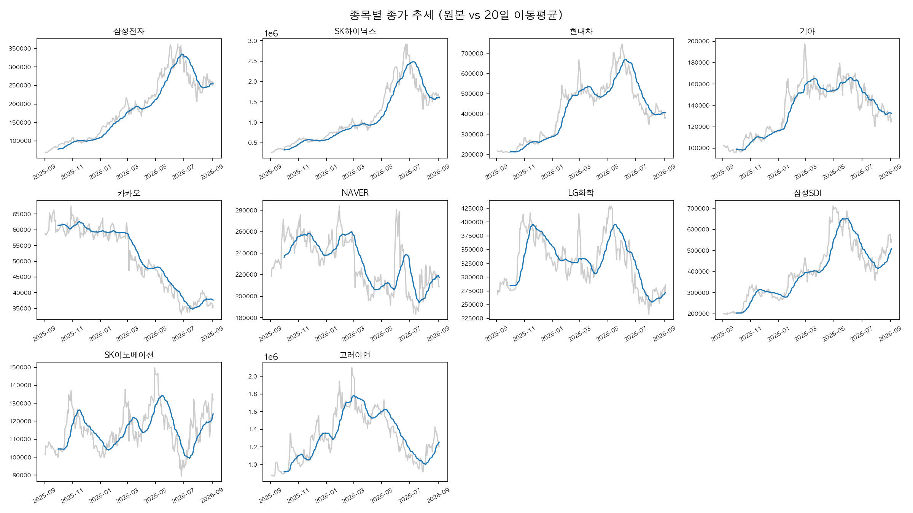
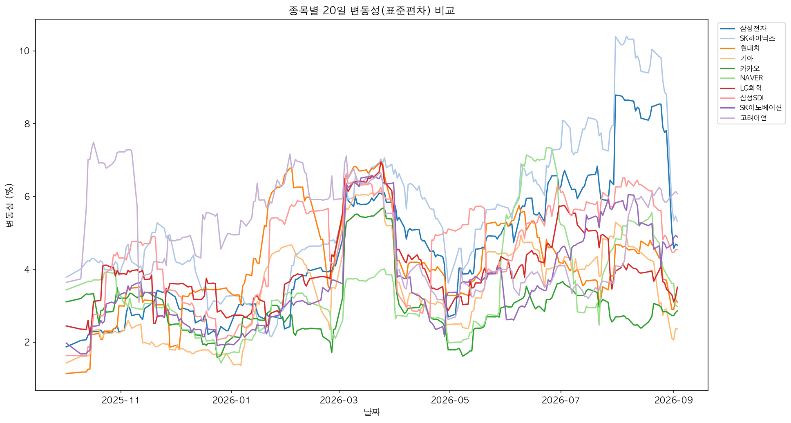
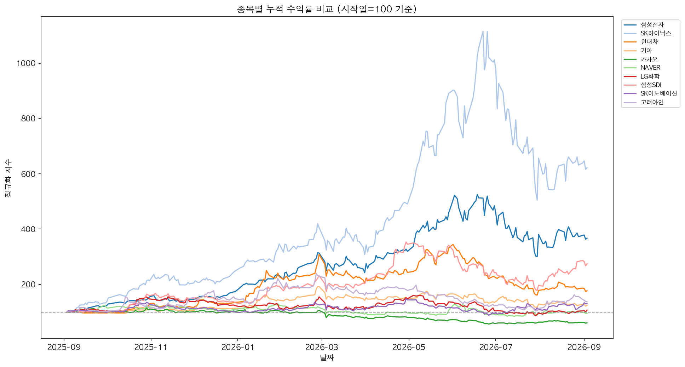

# M1-1 시계열 데이터 분석 리포트: 국내 대형주 10종목 비교

## 1. 분석 주제

국내 대형주 10종목의 최근 1년간 주가 흐름을 비교 분석한다. 반도체, 자동차, 플랫폼,
2차전지/화학, 비철금속 등 서로 다른 업종을 함께 포함시켜, 업종에 따라 추세/변동성/수익률
패턴이 어떻게 달라지는지, 그리고 시장 전체에 영향을 준 이벤트와 개별 종목 이슈를 구분할 수
있는지 확인하는 것을 목표로 한다.

- **데이터 출처**: Yahoo Finance (yfinance 라이브러리)
- **수집 기간**: 약 1년(2025년 9월 ~ 2026년 9월 기준), 일별 종가 기준
- **데이터 포인트**: 종목당 약 243개 (총 약 2,430개)
- **대상 종목 (업종별 그룹)**
  - 반도체: 삼성전자(005930.KS), SK하이닉스(000660.KS)
  - 자동차: 현대차(005380.KS), 기아(000270.KS)
  - 플랫폼: 카카오(035720.KS), NAVER(035420.KS)
  - 2차전지/화학: LG화학(051910.KS), 삼성SDI(006400.KS), SK이노베이션(096770.KS)
  - 비철금속: 고려아연(010130.KS)

## 2. 분석 질문

1. 업종별로 수익률 격차가 뚜렷하게 나타나는가?
2. 수익률이 높은 종목일수록 변동성도 함께 높은가, 아니면 예외가 있는가?
3. 종목들의 "최대 하락일"이 특정 날짜에 몰려 있는가? 몰려 있다면 시장 전체 이벤트로, 흩어져 있다면 개별 종목 이슈로 해석할 수 있는가?
4. 같은 업종(2차전지/화학) 안에서도 종목 간 수익률 격차가 존재하는가?

## 3. 데이터 설명

- yfinance를 통해 일별 시가/고가/저가/종가/거래량(OHLCV)을 수집했다. 결측치는 10종목 모두 존재하지 않았다.
- 분석 기법 2가지를 적용했다.
  - **20일 이동평균(MA_20)**: 최근 20 거래일 평균으로 단기 잔물결(노이즈)을 지우고 추세를 본다.
  - **일간 변화율(Daily_Return_%) 및 20일 변동성(Volatility_20)**: 전일 대비 등락률과 그 표준편차로 리스크를 본다.

**종목별 요약**

| 종목 | 기간 수익률 | 평균 20일 변동성 | 최대 하락일 | 하락폭 |
|---|---|---|---|---|
| SK하이닉스 | 522.02% | 5.58 | 2026년 7월 13일 | -15.37% |
| 삼성전자 | 267.01% | 4.58 | 2026년 7월 28일 | -13.39% |
| 삼성SDI | 173.95% | 4.63 | 2026년 3월 4일 | -13.97% |
| 현대차 | 76.87% | 4.22 | 2026년 3월 4일 | -15.80% |
| 고려아연 | 36.83% | 4.98 | 2026년 3월 4일 | -17.70% |
| SK이노베이션 | 30.57% | 3.74 | 2026년 3월 4일 | -16.73% |
| 기아 | 24.29% | 3.46 | 2026년 3월 4일 | -14.04% |
| LG화학 | 6.79% | 4.03 | 2026년 3월 4일 | -14.96% |
| NAVER | -4.55% | 3.51 | 2026년 3월 4일 | -11.86% |
| 카카오 | -39.05% | 2.99 | 2026년 3월 4일 | -16.28% |

## 4. 시각화

*그래프 1. 종목별 종가(연한 회색)와 20일 이동평균(파란색)을 겹쳐, 단기 잔물결과 큰 추세를 함께 확인할 수 있다.*

*그래프 2. 10종목의 20일 변동성을 한 화면에 겹쳐, 어느 시기에 시장이 출렁였는지 비교한다.*

*그래프 3. 시작일 가격을 100으로 정규화해, 절대 가격 차이와 무관하게 상대적 수익률을 비교한다.*

## 5. 인사이트

**인사이트 1. 10종목 중 8종목의 최대 하락일이 2026년 3월 4일로 동일하다 — 시장 전체 이벤트로 추정.**
- 관찰: 현대차, 기아, 카카오, NAVER, LG화학, 삼성SDI, SK이노베이션, 고려아연 8종목 모두 최대 하락일이 2026년 3월 4일이다. 반면 삼성전자(2026년 7월 28일)와 SK하이닉스(2026년 7월 13일)만 7월에 별도로 최대 하락일을 기록했다.
- 해석: 3월 4일 하락은 업종을 가리지 않고 대부분의 종목에 동시에 영향을 준 것으로 보아 코스피 전체 조정 국면(시장 전체 이벤트)일 가능성이 크다. 반면 반도체 2종목만 7월에 따로 급락한 것은 반도체 업종 고유의 이슈였을 가능성을 시사한다. (실제 원인은 데이터만으로 확정할 수 없는 가설이다.)

**인사이트 2. 업종별 수익률 격차가 뚜렷하다 — 반도체 > 2차전지 일부 > 자동차 > 플랫폼.**
- 관찰: 반도체 2종목 평균 수익률은 394.5%인 반면, 플랫폼 2종목(카카오, NAVER)은 평균 -21.8%로 유일하게 마이너스권에 머물렀다.
- 해석: 분석 기간 동안 반도체 업황 호조와 플랫폼 업종의 부진이 극명하게 갈렸다.

**인사이트 3. 수익률과 변동성의 상관관계는 대체로 성립하지만, 고려아연은 예외다.**
- 관찰: SK하이닉스(수익률 1위, 변동성 1위)처럼 대체로 수익률 순위와 변동성 순위가 비슷하게 움직이지만, 고려아연은 변동성이 4.98로 2번째로 높은데도 수익률은 36.83%로 중간 수준에 그쳤다.
- 해석: 고려아연은 등락폭 자체는 컸지만 방향성 있는 상승보다는 오르내림을 반복했을 가능성이 있다. "변동성이 크다고 반드시 수익률도 높은 것은 아니다"라는 예외 사례로 볼 수 있다.

**인사이트 4. 같은 2차전지/화학 업종 안에서도 종목별 격차가 3종목 모두 다르게 컸다.**
- 관찰: 같은 업종으로 묶인 삼성SDI(173.95%), SK이노베이션(30.57%), LG화학(6.79%)의 수익률이 최대 6배 이상 차이난다.
- 해석: 업종 분류만으로는 개별 종목의 실적을 설명하기 부족하며, 같은 산업 내에서도 사업 구조(배터리 셀 vs 소재 vs 정유·화학 겸업)에 따라 주가 흐름이 크게 갈릴 수 있음을 보여준다.

## 6. 결론 및 한계점

- 분석 기간 동안 반도체 업종이 가장 뚜렷한 강세를, 플랫폼 업종이 가장 뚜렷한 약세를 보였다.
- 대부분 종목의 최대 하락일이 2026년 3월 4일로 겹치는 점은 시장 전체 이벤트의 존재 가능성을 시사하지만, 실제 원인(정책, 거시경제 이벤트 등)은 본 분석(가격 데이터만 사용)으로는 확인할 수 없는 가설 단계다.
- 1년치 일별 데이터만 사용했기 때문에 장기 추세 판단에는 한계가 있고, 반도체 슈퍼사이클 등 특정 구간의 영향이 과대 반영됐을 수 있다.
- "업종"이라는 큰 분류만으로는 개별 종목의 편차(예: 2차전지/화학 3종목)를 설명하기 부족하다는 점도 확인했다.

## 7. AI 사용 로그

1. **사용 작업**: 데이터 수집/정제/분석 Python 코드(main.py) 및 시각화 코드(visualize.py) 작성(4종목 → 20종목 → 10종목으로 범위 조정 포함), macOS venv 환경설정 트러블슈팅(externally-managed-environment 오류 해결), 저장된 CSV에서 요약 통계만 재추출하는 보조 스크립트(summarize.py) 작성, REPORT.md 초안 작성 지원
2. **사용 이유**: 반복적인 보일러플레이트 코드 작성 시간 절감, Homebrew Python 환경 특유의 에러를 빠르게 진단하기 위해, 종목 수 변경 시마다 매번 코드를 재작성하지 않도록 하기 위해
3. **검증 방법**: 생성된 코드를 직접 로컬에서 실행해 콘솔 출력(수집 개수, 결측치 여부, 종목별 수익률·변동성·최대하락일 수치)을 확인했고, 리포트의 표와 인사이트에 기재한 모든 수치는 실제 콘솔 출력값과 대조해 일치 여부를 확인했다.
